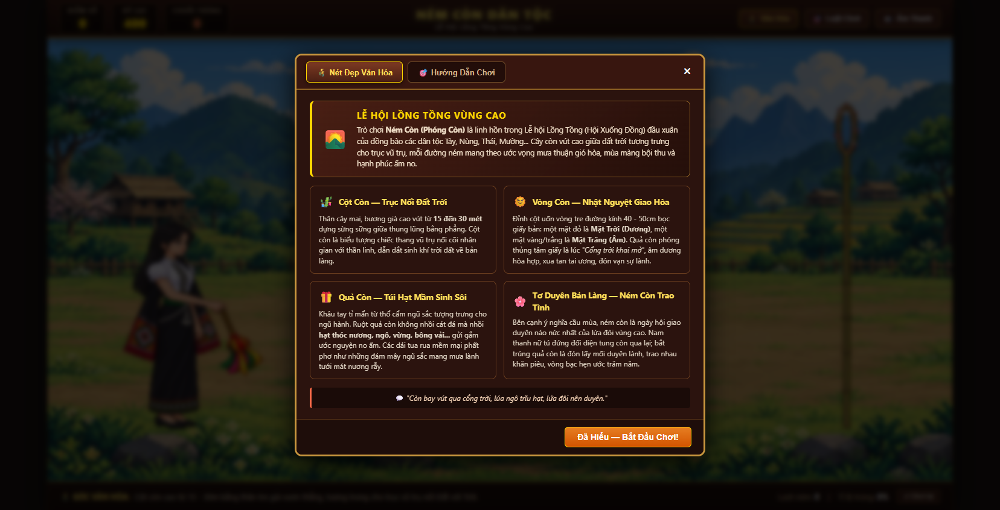
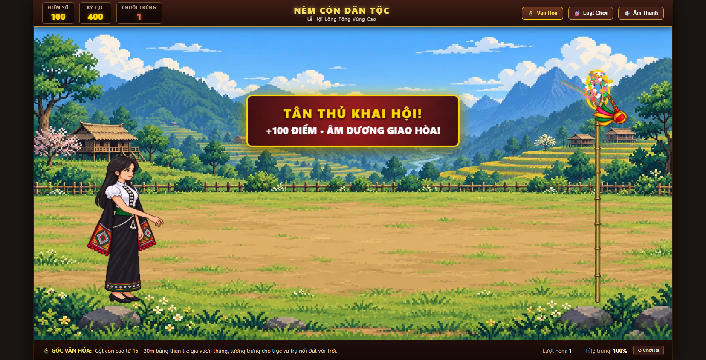

# 🎯 Ném Còn Dân Tộc — Lễ Hội Lồng Tồng Vùng Cao
> **Trò chơi dân gian Việt Nam tái hiện văn hóa truyền thống Tây Bắc trên nền web (HTML5 Canvas & Web Audio API)**

---

## 🌾 Chiều Sâu Văn Hóa & Phong Tục Ném Còn

**Ném Còn (Phóng Còn)** là một trong những nét sinh hoạt văn hóa tinh thần đặc sắc và thiêng liêng nhất của đồng bào các dân tộc vùng cao Tây Bắc, Đông Bắc (Tày, Nùng, Thái, Mường...) mỗi độ xuân về trong **Lễ hội Lồng Tồng (Hội Xuống Đồng)**.

### 1. 🎋 Cột Còn — Trục Vũ Trụ Nối Liền Đất Trời
Cột còn được làm từ thân một cây mai, bương già thẳng tắp, cao từ **15 đến 30 mét**, dựng sừng sững giữa thung lũng bằng phẳng và rộng lớn nhất bản. Cột còn tượng trưng cho **trục vũ trụ** (cây cầu nối tâm linh nối cõi trần gian với cõi thần linh), dẫn dắt sinh khí đất trời giao hòa, xua tan mây mù tai ương và mang phước lành về bản làng.

### 2. 🌞 Vòng Còn — Nhật Nguyệt Giao Hòa & Khai Mở Cổng Trời
Trên đỉnh cột tre uốn một vòng tròn đường kính 40 - 50cm, dán kín bằng giấy bản:
* Một mặt dán giấy đỏ tượng trưng cho **Mặt Trời (Dương)**.
* Mặt kia dán giấy vàng hoặc trắng tượng trưng cho **Mặt Trăng (Âm)**.

Thời khắc quả còn phóng xuyên thủng tâm giấy vòng còn là giây phút thiêng liêng và bùng nổ nhất lễ hội: biểu trưng cho **"Cổng trời đã khai mở"**, âm dương hòa quyện, báo hiệu một năm mới mưa thuận gió hòa, vạn vật sinh sôi nảy nở.

### 3. 🎁 Quả Còn Ngũ Sắc — Túi Hạt Mầm No Ấm
Quả còn được các cô gái khâu tay tỉ mỉ từ những múi vải thổ cẩm mang 5 sắc màu biểu trưng cho Ngũ hành (Kim - Mộc - Thủy - Hỏa - Thổ) và bốn phương tám hướng:
* **Ruột quả còn:** Không nhồi cát đá mà nhồi **các hạt giống nông nghiệp quý**: hạt thóc nương, ngô, vừng, đỗ, hạt bông vải... gửi gắm ước nguyện về sự sinh sôi, mùa màng trĩu hạt.
* **Tua rua ngũ sắc:** Rủ dài mềm mại như những dải mây ngũ sắc mang mưa lành tưới tắm nương ngô đồng lúa.
* Sau lễ hội, người ném trúng hoặc bắt được quả còn sẽ mang các hạt giống bên trong về trộn với thóc giống của gia đình để lấy vía may mắn cho vụ mùa mới.

### 4. 🌸 Tơ Duyên Bản Làng — Ném Còn Trao Tình
Bên cạnh ý nghĩa nông nghiệp tâm linh, ném còn là ngày hội giao duyên rộn rã nhất của nam thanh nữ tú. Các chàng trai cô gái mặc những bộ váy áo thổ cẩm rực rỡ nhất, đứng đối diện nhau qua bãi hội tung quả còn qua lại. Bắt trúng quả còn là đón lấy lời hẹn ước; họ trao nhau khăn piêu, túi gấm, vòng bạc làm tín vật nên duyên vợ chồng trăm năm.

---

## 🎮 Cách Chơi & Cơ Chế Vật Lý Chuẩn Xác

1. **Giữ chuột (hoặc chạm giữ màn hình / phím Space):**
   * Nhân vật bắt đầu xoay quả còn lấy đà.
   * Lực ném tích lũy dần theo thời gian xoay (từ 20% đến 100%).
2. **Căn lực ném vừa phải (60% - 70%):**
   * **Lực chuẩn (60% - 70% - khoảng vòng xoay thứ 2):** Quả còn bay vồng cung tuyệt đẹp và chui lọt qua vòng còn trên đỉnh cột.
   * **Quá mạnh (>70%):** Quả còn bay vọt qua cột.
   * **Quá yếu (<60%):** Quả còn rơi hụt phía trước.
3. **Thả chuột đúng nhịp:**
   * Thả chuột ngay khi tay nhân vật vung hất về phía trước. Quả còn bay xuất phát chuẩn xác từ chính bàn tay nhân vật, quả cầu dẫn hướng phía trước và các dải tua rua bay uốn lượn theo sau.
4. **Ghi điểm & Lời chúc may mắn:**
   * Mỗi lần ném xuyên tâm vòng còn: **+100 điểm**, kích hoạt pháo giấy mừng hội và đón nhận các lời chúc phúc lành truyền thống (*Mưa thuận gió hòa, Mùa màng bội thu, Âm dương giao hòa...*).
   * Giữ chuỗi ném trúng liên tiếp để nhận danh hiệu vinh danh lễ hội (*Tân Thủ Vào Hội, Tay Ném Bản Làng, Khai Mở Cổng Trời, Đệ Nhất Danh Còn Tây Bắc*).

---

## 🛠️ Công Nghệ Phát Triển

* **HTML5 Canvas 2D:** Hiển thị mượt mà 60 FPS chuẩn tỷ lệ `1672 x 941`, responsive toàn màn hình máy tính và thiết bị di động.
* **Physics Engine Tùy Chỉnh:**
  * Mô phỏng chuyển động ném xiên với trọng lực $g$ và lực cản khí động học (Aerodynamic drag).
  * Kiểm tra va chạm liên tục (Continuous Collision Detection - CCD) giữa quả còn với khẩu độ hình elip của vòng tre và thân cột.
* **Sprite Alignment Frame-by-Frame:**
  * Toàn bộ các frame động tác quay lấy đà (`Spin 1-9`) và vung ném (`Throw`) được căn chỉnh tọa độ tiếp đất của bàn chân tuyệt đối, loại bỏ hoàn toàn rung lắc khung hình.
  * Tọa độ phát lực được ghim trực tiếp vào bàn tay nhân vật ở từng frame.
  * Tỉ lệ quả còn bay được đồng bộ 1:1 chuẩn xác với kích thước quả còn trên tay nhân vật.
* **Web Audio API:** Tự động tổng hợp âm thanh chân thực bằng thuật toán dao động âm thanh (oscillator & pink noise buffer) mà không cần nạp file audio ngoài:
  * Tiếng gió rít khi xoay quả còn (`whistling whoosh`).
  * Tiếng vung tay ném dứt khoát.
  * Tiếng lách cách khi va chạm vào vòng tre.
  * Tiếng trống hội trầm vang kết hợp hòa âm ngũ cung Tây Bắc (Đàn Tính) rộn rã khi ném trúng tâm vòng.

---

## 🚀 Trải Nghiệm Trực Tiếp

Truy cập và chơi ngay trên trình duyệt tại: **[https://vlantoy.github.io/nem-con-game/](https://vlantoy.github.io/nem-con-game/)**
